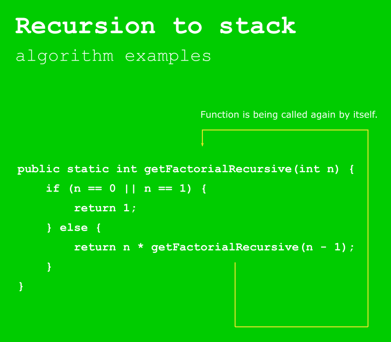
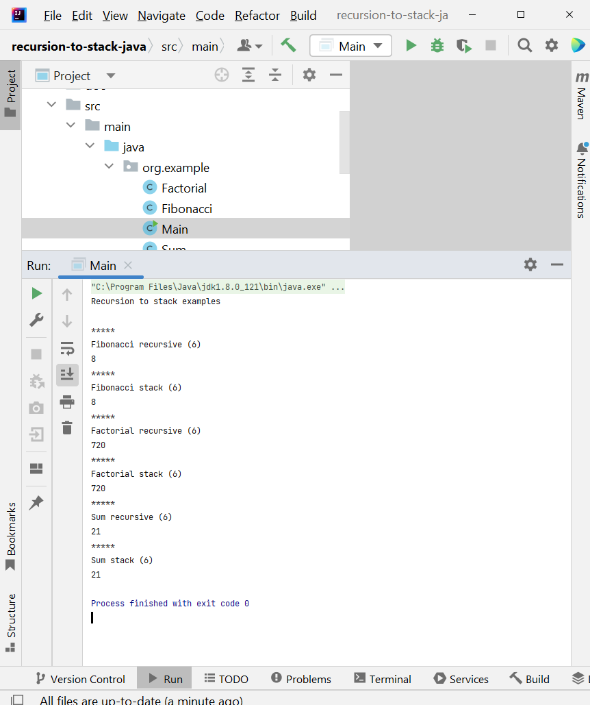
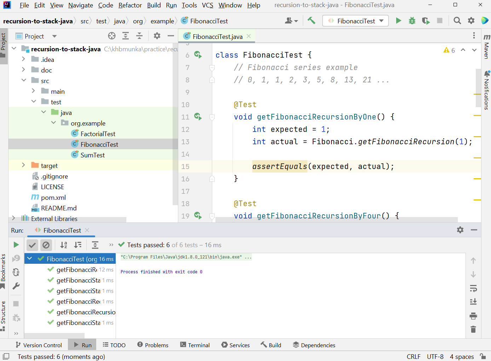

# Recursion to stack conversion
## Algorithms and Java practice

In this repository I will show you, how you can implement simple algorithms with recursion and stack.

## System requirements

* Java 8
* JUnit
* Apache Maven 3.8.1

## Test environment

Tested on **Windows 10**.

## Code examples

* Fibonacci series
* Factorial
* Sum
* Unit tests for each function

## Screen examples

Running main program

Running unit tests

## History

Made with 🧡 (love) and ☕ (coffee) by Adam Burucs since September, 2023.

## Tools

For coding and graphic design I used

* IntelliJ IDEA Community Edition
* Inkscape

## License

Please see [LICENSE file](LICENSE).